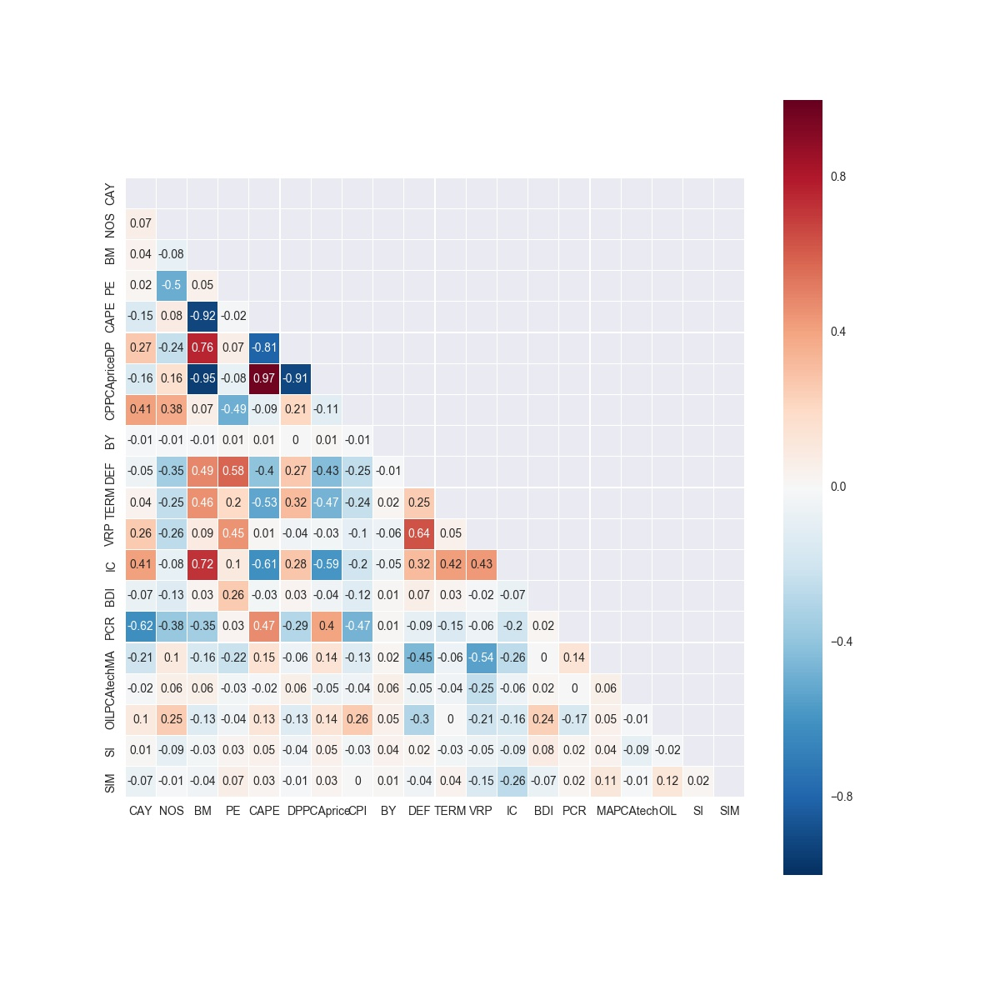
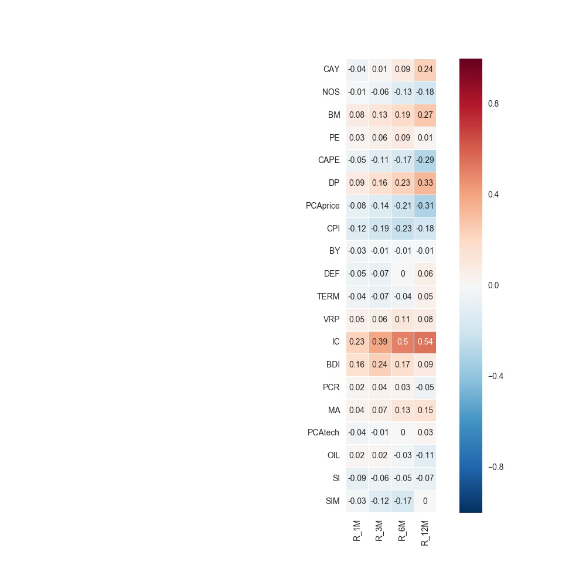

# Linear_Forecasting
## Dave Hamilton, Yuan Ni, Kaili Li
A Project Verifying Hull and Qiao’s Paper On Market Timing

## A. Data Description
1. Dividend-Price Ratio (DP)
- log of a twelve-month moving sum of dividends paid on the S&P 500 index minus the log of S&P 500 prices
- source: http://www.multpl.com/
2. Price-to-Earnings Ratio (PE)
- the price divided by earnings over the last 12 months
- source: http://www.multpl.com/
3. Book-to-Market Ratio (BM)
- book value of the S&P 500 divided by the S&P 500 index
- source: Bloomberg
4. Cyclically Adjusted Price to Earnings Ratio (CAPE)
- price divided by the average inflation adjusted earnings over the last ten years    
- source: http://www.multpl.com/
5. Principal Component of Price Ratios (PCAprice)
- the largest principal component of these variables  
- source: calculated in calculateFirstPC.ipynb
6. Bond Yield (BY)
- the 10-year Treasury bond yield divided by the bond yield EMA    
- source:Quandl
7. Default Spread (DEF)
- the difference between Baa yield and Aaa yield    
- source:Quandl
8. Term Spread (TERM)
- the yield difference between the 10-year Treasury Note and the three-month Treasury Bill    
- source:Quandl
9. Cointegrating Residual of Consumption, Assets, and Wealth (CAY)
- cointegrating residual of log consumption, assets, and wealth
- source: http://faculty.haas.berkeley.edu/lettau/data_cay.html
10. Sell in May and Go Away (SIM)
- SIM = d/130, in which d is the number of days in the next 130 business days that lie between the second business day in May and the 15th business day of October  
- source:calculated in calculateSIM.ipynb
11. Variance Risk Premium (VRP)
- VIX minus the volatility forecast from a GARCH-style model incorporating the Yang and Zhang (2000) estimator using the open, high, low, and close data
- source: VIX from Quandl, calculated in VRP.ipynb
12. Implied Correlation (IC)
- the average equity options-implied correlation, CBOE S&P 500 Implied Correlation Index
- source: Quandl
13. Baltic Dry Index (BDI)
- three month change in the BDI
- source: Bloomberg
14. New Orders/Shipments (NOS)
- log of the originally reported new orders divided by the original shipments
- source: http://www-bcf.usc.edu/~tuzel/
15. Consumer Price Index (CPI)
- the change in CPI over the last twelve months  
- source: Quandl
16. Ratio of Stock Price to Commodity Price (PCR)
- log of the ratio between SPY and GSCI  
- source: Bloomberg
17. Moving Average (MA)
- 0/1 signal based on SMA(20)-SMA(200)
- source: alculated in SPX_tech.xlsx
18. Principal Component of Technical Indicators (PCAtech)
- the first principal component of a set of technical indicators(Neely et al,2014)  
- source: calculated in SPX_tech.xlsx and calculateFirstPC.ipynb
19. Oil Price Shocks (OIL)
- the log of the current front oil futures price (CL1) minus the log of the fourth futures price (CL4) with a three month lag    
- source: Bloomberg
20. Short Interest (SI)
- the sum of all shares short on the NYSE divided by the average daily trading volume over the past 30 days    
- source: Quandl

**Basic Data Description**
|          | count | mean               | std               | min             | max            | q1               | q2              | q3              | skew              | kurt            |
|----------|-------|--------------------|-------------------|-----------------|----------------|------------------|-----------------|-----------------|-------------------|-----------------|
| CAY      | 6909  | -0.000904381149949 | 0.0209688905533   | -0.047186097    | 0.032568153    | -0.011777221     | -0.001940168    | 0.014527666     | -0.493336630069   | -0.370869609116 |
| NOS      | 6909  | 0.00504172818063   | 0.0445885665426   | -0.1934         | 0.2535         | -0.0202          | 0.0076          | 0.0295          | 0.125103839928    | 4.30142294705   |
| BM       | 6909  | 0.373861720046     | 0.0851323889466   | 0.200549506     | 0.609495947    | 0.331005263      | 0.36575107      | 0.437502734     | 0.00385877494012  | -0.259017953807 |
| PE       | 6909  | 24.4706527717      | 14.7653219917     | 13.5            | 123.73         | 17.8             | 21.22           | 26.11           | 4.57207408791     | 24.0919886688   |
| CAPE     | 6909  | 25.4365682443      | 6.53843051619     | 13.32           | 44.19          | 20.83            | 24.86           | 27.21           | 1.08138440525     | 0.979710748093  |
| DP       | 6909  | 0.0208938196555    | 0.00603551213975  | 0.0111          | 0.0388         | 0.0173           | 0.0197          | 0.023           | 0.758233194907    | 0.0115508989808 |
| PCAprice | 6909  | -0.00358511384288  | 1.63232915709     | -4.22945573991  | 3.66975698175  | -1.07127517622   | 0.131289824403  | 0.720248136314  | 0.154624636934    | 0.0548375385057 |
| CPI      | 6909  | 0.0247478059803    | 0.0130478568309   | -0.01958761     | 0.063795853    | 0.016847246      | 0.025828753     | 0.031571219     | -0.0529142779943  | 1.10734982881   |
| BY       | 6909  | 0.999982965246     | 0.000991418501536 | 0.988032304     | 1.005629708    | 0.999500951      | 0.999974136     | 1.000443516     | -0.222691044519   | 6.51391874792   |
| DEF      | 6909  | 0.958504848748     | 0.40143774888     | 0.5             | 3.5            | 0.7              | 0.88            | 1.07            | 3.13006318154     | 13.5024052542   |
| TERM     | 6909  | 1.83887103778      | 1.12161512878     | -0.95           | 3.87           | 0.96             | 1.93            | 2.73            | -0.245006341328   | -0.893247662463 |
| VRP      | 6820  | -2.95033456903     | 7.90666582209     | -13.14512489    | 58.40487611    | -8.66512489      | -4.90512589     | 0.45487511      | 2.103230068       | 7.61118072125   |
| IC       | 2643  | 57.9802762013      | 9.59252647799     | 19.92           | 83.94          | 51.79            | 58.05           | 63.83           | -0.00105350318824 | -0.155088121227 |
| BDI      | 6909  | 0.0520273466331    | 0.331561170508    | -0.899382716    | 2.379464286    | -0.134961954     | 0.017391304     | 0.207317073     | 0.930629605592    | 3.60006764108   |
| PCR      | 6151  | -1.51981454131     | 0.205399228717    | -1.940029856    | -0.92720832    | -1.662989207     | -1.59071866     | -1.421682305    | 1.07643679001     | 0.455196009946  |
| MA       | 6909  | 0.731654363873     | 0.443130542025    | 0.0             | 1.0            | 0.0              | 1.0             | 1.0             | -1.04561120665    | -0.906697204537 |
| PCAtech  | 6909  | -0.000808699090036 | 2.89974646059     | -4.25481540632  | 3.04245306357  | -3.17439321489   | 0.787816259245  | 3.04245306357   | -0.324666381967   | -1.53402989982  |
| OIL      | 6909  | 0.00297474444879   | 0.0801776359742   | -0.473047978    | 0.34416766     | -0.039927947     | 0.011175445     | 0.051371884     | -0.883670224884   | 3.64332353134   |
| SI       | 1044  | 0.436535780545     | 0.509636327399    | 0.003392407     | 8.411005096    | 0.1508797895     | 0.298739633     | 0.553570292     | 5.93903684271     | 68.4262552737   |
| SIM      | 6909  | 0.47720698754      | 0.279081046954    | 0.0             | 0.930769231    | 0.238461538      | 0.484615385     | 0.723076923     | -0.0321255650479  | -1.21852938692  |
| R_1M     | 6887  | 0.00741404431161   | 0.0446934070756   | -0.297937445211 | 0.224056845652 | -0.0153885902639 | 0.0108855517281 | 0.0332585539193 | -0.670784398767   | 3.56583312991   |
| R_3M     | 6844  | 0.0217318672282    | 0.0748894796757   | -0.409637987038 | 0.38818677664  | -0.0126585944902 | 0.028235402183  | 0.065624954687  | -0.709525013121   | 2.93781751688   |
| R_6M     | 6783  | 0.0425025550521    | 0.108878301182    | -0.464658269149 | 0.502372400337 | -0.0084575498662 | 0.0518021269429 | 0.104880981682  | -0.788352656498   | 2.56095796224   |
| R_12M    | 6657  | 0.0890520727403    | 0.163219627011    | -0.488228237235 | 0.685734557226 | 0.0247267933835  | 0.105477369686  | 0.192518986515  | -0.723638977875   | 1.06570374293   |

**Correlation of Predictors**

**Correlation with future return**

Normal text **bold** then *italic*.
Escape \* \` \< \_ \# \\ & more.

1. Order list
- Unorder list ( - or + )

code: `a === a`

> blockquote

URL: [Edditoria][1] | image: ![2][]

[1]: https://edditoria.blogspot.com
[2]: https://avatars0.githubusercontent.com/u/2234073?v=3&s=40

<!-- please comment -->

# Enjoy! :)

[[https://github.com/niyuan17/Linear_Forecasting/blob/master/correlation_of_predictors.jpg|alt=octocat]]

